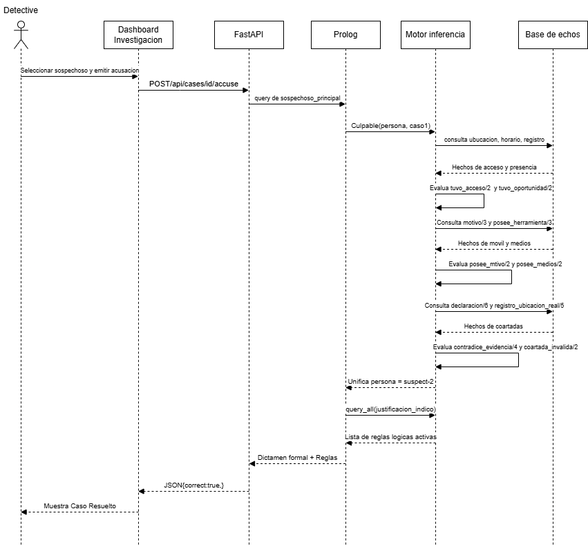
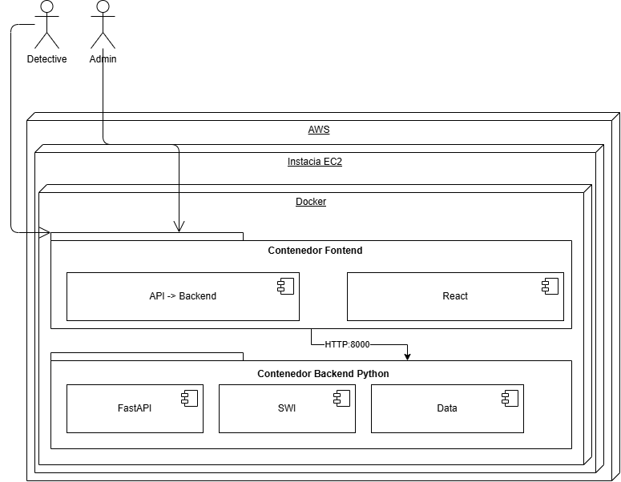

# MANUAL TÉCNICO - LOGIC DETECTIVE
**Sistema Experto de Investigación Criminal con Inferencia Simbólica en Prolog**  
**Facultad de Ingeniería - Universidad de San Carlos de Guatemala**  
**Escuela de Ciencias y Sistemas - Inteligencia Artificial 1 | Sección A**  
**Segundo Semestre 2026 | Grupo 9**

---

## 1. INTRODUCCIÓN Y FUNDAMENTOS TEÓRICOS

### 1.1 Naturaleza del Sistema
**Logic Detective** es una solución de software basada en el paradigma de **Sistemas Expertos** y **Razonamiento Basado en Conocimiento**. Implementa lógica de predicados de primer orden para emular el proceso de deducción de un investigador forense frente a un delito.

### 1.2 Componentes del Sistema Experto
1. **Base de Hechos:** Almacena evidencias periciales, perfiles de sospechosos, registros de cámaras de seguridad, accesos biométricos/tarjetas, líneas temporales y testimonios.
2. **Base de Reglas:** Conjunto de cláusulas de Horn y predicados de inferencia que modelan conceptos jurídicos y lógicos: acceso material, ventana de oportunidad, móvil criminal, medios físicos/técnicos, contradicciones testimoniales y validez de coartadas.
3. **Motor de Inferencia:** Implementado en **SWI-Prolog**, utiliza el algoritmo de resolución SLD (*Selective Linear Definite clause resolution*) con encadenamiento hacia atrás (*backward chaining*), retroceso (*backtracking*) y unificación de términos.
4. **Módulo de Explicación:** Genera la justificación deductiva detallando las premisas y reglas formales que fundamentaron el dictamen de culpabilidad.

---

## 2. ARQUITECTURA GENERAL DEL SISTEMA

El sistema sigue una arquitectura desacoplada de tres capas orquestada mediante microservicios en contenedores Docker:

```
+-------------------------------------------------------------------------+
|                        CAPA DE PRESENTACIÓN                             |
|   React.js 18 + Vite + CSS Modules + Nginx Web Server (Puerto 80)       |
|   - Exploración de Expedientes y Pistas                                 |
|   - Interrogatorios Progresivos en Tiempo Real                          |
|   - Generador y Exportador de Informe Pericial Forense                  |
+------------------------------------+------------------------------------+
                                     | HTTP / REST (JSON)
+------------------------------------v------------------------------------+
|                         CAPA DE SERVICIOS (API)                         |
|   FastAPI (Python 3.11) + Uvicorn ASGI Server (Puerto 8000)             |
|   - Routers Modulares: Hechos, Admin CRUD, Inferencia, Contradicciones  |
|   - Modelos de Datos Pydantic con validación de tipos                   |
|   - Bridge PySwip (Interfaz C-Foreign Language Interface con libpl)     |
+------------------------------------+------------------------------------+
                                     | Consultas Lógicas / Directivas C
+------------------------------------v------------------------------------+
|                    CAPA DE CONOCIMIENTO E INFERENCIA                    |
|   SWI-Prolog Engine (Core Lógico)                                       |
|   - acceso_oportunidad.pl | motivos_medios.pl | evidencias.pl           |
|   - declaraciones_contradicciones.pl | reglas_investigacion.pl          |
|   - Base de Datos Persistente en Archivos de Hechos (.pl)               |
+-------------------------------------------------------------------------+
```

---

## 3. DIAGRAMAS

### 3.1 Diagrama de Secuencia: Flujo de Inferencia de Acusación


---

### 3.2 Diagrama de Despliegue en AWS EC2



---

## 4. DICCIONARIO DE REGLAS DE INFERENCIA EN PROLOG

El motor se compone de más de **40 reglas lógicas** estructuradas en los siguientes módulos:

### 4.1 Módulo `acceso_oportunidad.pl`
```prolog
% hora_a_minutos(+Hora, -Minutos)
% Transforma un átomo 'HH:MM' en su representación entera acumulada del día.
hora_a_minutos(Hora, Minutos) :-
    atomic_list_concat([Horas, MinutosTexto], ':', Hora),
    atom_number(Horas, H),
    atom_number(MinutosTexto, M),
    Minutos is H * 60 + M.

% hora_en_intervalo(+Hora, +Inicio, +Fin)
% Verifica si una hora cae dentro del rango permitido, admitiendo franjas que cruzan medianoche.
hora_en_intervalo(Hora, Inicio, Fin) :-
    hora_a_minutos(Hora, H),
    hora_a_minutos(Inicio, I),
    hora_a_minutos(Fin, F),
    ( I =< F -> (H >= I, H =< F) ; (H >= I ; H =< F) ).

% tuvo_acceso(?Persona, +Caso)
% Infiere si una persona estuvo físicamente presente en el lugar del delito.
tuvo_acceso(Persona, Caso) :-
    persona(Caso, Persona, _, sospechoso),
    once(( registro_acceso(Caso, Persona, Lugar, _, _, _), ubicacion_incidente(Caso, Lugar) )).

% tuvo_oportunidad(?Persona, +Caso)
% Infiere si la presencia física coincidió con la franja horaria crítica del incidente.
tuvo_oportunidad(Persona, Caso) :-
    tuvo_acceso(Persona, Caso),
    once((
        registro_acceso(Caso, Persona, Lugar, Hora, _, _),
        ubicacion_incidente(Caso, Lugar),
        horario_incidente(Caso, Inicio, Fin),
        hora_en_intervalo(Hora, Inicio, Fin)
    )).
```

### 4.2 Módulo `motivos_medios.pl` y `evidencias.pl`
```prolog
% posee_motivo(?Persona, +Caso)
% Comprueba si el individuo cuenta con una causa criminal no nula (deuda, venganza, etc.).
posee_motivo(Persona, Caso) :-
    motivo(Caso, Persona, Motivo),
    Motivo \= ninguno_identificado,
    Motivo \= ninguno_claro.

% posee_medios(?Persona, +Caso)
% Determina si cuenta con medios físicos (llaves), técnicos (herramientas/código) o conocimiento.
posee_medios(Persona, Caso) :- medio_fisico(Persona, Caso).
posee_medios(Persona, Caso) :- medio_tecnico(Persona, Caso).
posee_medios(Persona, Caso) :- medio_conocimiento(Persona, Caso).

% medio_fisico(?Persona, +Caso)
medio_fisico(Persona, Caso) :-
    posee_herramienta(Caso, Persona, Herramienta),
    herramienta(Caso, Herramienta, acceso).

% medio_tecnico(?Persona, +Caso)
medio_tecnico(Persona, Caso) :-
    posee_herramienta(Caso, Persona, Herramienta),
    herramienta(Caso, Herramienta, Tipo),
    Tipo \= acceso.

% medio_conocimiento(?Persona, +Caso)
medio_conocimiento(Persona, Caso) :-
    conocimiento(Caso, Persona, _).

% justificacion_indicio(+Persona, +Caso, -Motivos, -Medios, -Evidencias)
% Extrae la lista formal de premisas demostradas para la explicación del veredicto.
justificacion_indicio(Persona, Caso, Motivos, Medios, Evidencias) :-
    findall(Motivo, (motivo(Caso, Persona, Motivo), Motivo \= ninguno_identificado, Motivo \= ninguno_claro), Motivos),
    findall(Herramienta, posee_herramienta(Caso, Persona, Herramienta), Medios),
    findall(Evidencia, evidencia_relacionada(Caso, Evidencia, Persona), Evidencias),
    Motivos \= [], Medios \= [], Evidencias \= [].
```

### 4.3 Módulo `declaraciones_contradicciones.pl`
```prolog
% contradice_evidencia(+Caso, ?Persona, ?Evidencia, -Detalle)
% Descubre incongruencias entre la coartada alegada y los registros objetivos de cámaras/logs.
contradice_evidencia(Caso, Persona, Evidencia, Detalle) :-
    declaracion(Caso, Persona, Afirmacion, _, _, LugarAfirmado),
    registro_ubicacion_real(Caso, Persona, HoraReal, LugarReal, Fuente),
    LugarAfirmado \= LugarReal,
    evidencia(Caso, Evidencia, _, _, LugarReal),
    atomic_list_concat([Persona, ' afirmo estar en ', LugarAfirmado, ' pero evidencia/registro (', Fuente, ') lo situa en ', LugarReal, ' a las ', HoraReal, '. Declaracion: "', Afirmacion, '"'], Detalle).

% dio_informacion_falsa(+Caso, ?Persona, -Razon)
% Infiere falsedad testimonial demostrada por evidencia o testigo presencial.
dio_informacion_falsa(Caso, Persona, Razon) :-
    contradice_evidencia(Caso, Persona, Evidencia, DetalleEv),
    atomic_list_concat(['Informacion falsa respecto a evidencia ', Evidencia, ': ', DetalleEv], Razon).

% posibles_complices(+Caso, ?Principal, ?Complice, -Razon)
% Infiere relaciones de complicidad basadas en vínculos previos en el bajo mundo o finanzas.
posibles_complices(Caso, Principal, Complice, Razon) :-
    relacion_previa(Caso, Principal, Complice, TipoRel),
    Principal \= Complice,
    atomic_list_concat([Complice, ' es posible complice de ', Principal, ' debido a relacion previa (', TipoRel, ') en el caso.'], Razon).
```

### 4.4 Módulo `reglas_investigacion.pl` y `inferencias.pl`
```prolog
% coartada_invalida(+Caso, ?Persona)
% Refuta la coartada si fue marcada inválida o presenta contradicción formal.
coartada_invalida(Caso, Persona) :- coartada(Caso, Persona, _, false, _).
coartada_invalida(Caso, Persona) :- coartada(Caso, Persona, _, _, _), contradiccion(Caso, _, _, Persona).

% coartada_valida(+Caso, ?Persona)
% Valida la coartada si no posee contradicciones registradas ni presencia criminal.
coartada_valida(Caso, Persona) :- coartada(Caso, Persona, _, true, _), \+ contradiccion(Caso, _, _, Persona).

% culpable(?Persona, +Caso)
% Teorema de culpabilidad formal del sistema experto.
culpable(Persona, Caso) :-
    tuvo_oportunidad(Persona, Caso),
    posee_motivo(Persona, Caso),
    posee_medios(Persona, Caso),
    coartada_invalida(Caso, Persona).
```

---

## 5. GESTIÓN DINÁMICA DE HECHOS (CRUD Y PERSISTENCIA)

Para evitar errores de procedimiento estático (`permission_error(modify, static_procedure, ...)`), el motor declara directivas dinámicas globales en `data/investigacion_data.pl` y `crud.pl`:

```prolog
:- dynamic lugar/3.
:- dynamic coartada/5.
:- dynamic testimonio/4.
:- dynamic contradiccion/4.
:- dynamic linea_tiempo/4.
:- dynamic testigo/5.
:- dynamic camara/6.
:- dynamic registro_acceso/6.
:- dynamic perfil/5.
:- dynamic persona/4.
:- dynamic caso/4.
```

### Eliminación sin Huérfanos (`eliminar_caso/1`)
Al invocar la eliminación de un caso, se ejecutan predicados `retractall/1` sincronizados con el guardado en disco:
```prolog
eliminar_caso(Id) :-
    retractall(caso(Id,_,_,_)),
    retractall(persona(Id,_,_,_)),
    retractall(motivo(Id,_,_)),
    retractall(herramienta(Id,_,_)),
    retractall(posee_herramienta(Id,_,_)),
    retractall(evidencia(Id,_,_,_,_)),
    retractall(evidencia_relacionada(Id,_,_)),
    retractall(declaracion(Id,_,_,_,_)),
    retractall(lugar(Id,_,_)),
    retractall(coartada(Id,_,_,_,_)),
    retractall(testimonio(Id,_,_,_)),
    retractall(contradiccion(Id,_,_,_)),
    retractall(linea_tiempo(Id,_,_,_)),
    retractall(testigo(Id,_,_,_,_)),
    retractall(camara(Id,_,_,_,_,_)),
    retractall(registro_acceso(Id,_,_,_,_,_)),
    retractall(perfil(Id,_,_,_,_)),
    guardar_casos,
    guardar_motivos_medios,
    guardar_evidencias,
    guardar_relaciones_evidencia,
    guardar_declaraciones.
```

---

## 6. ESPECIFICACIÓN DE ENDPOINTS REST (FastAPI)

### 6.1 Catálogo y Consultas Generales
* `GET /api/cases`
  * **Respuesta (200 OK):** `List[CaseSummary]` con `id`, `title`, `description`, `difficulty`, `suspectsCount`, `evidenceCount`, `placesCount`.
* `GET /api/cases/{case_id}`
  * **Respuesta (200 OK):** Detalle completo con listas de `suspects`, `evidence`, `places`, `timeline`, `contradictions` y `rules`.

### 6.2 Peritajes y Líneas de Investigación
* `GET /api/cases/{case_id}/cameras` -> Listado de cámaras con horarios de grabación y observaciones.
* `GET /api/cases/{case_id}/access` -> Registros biométricos y de tarjetas magnéticas.
* `GET /api/cases/{case_id}/witnesses` -> Declaraciones de testigos presenciales.
* `GET /api/cases/{case_id}/clues` -> Pistas dinámicas generadas desde los eventos cronológicos del motor.
* `GET /api/casos/{case_id}/contradicciones` -> Incongruencias lógicas detectadas entre declaraciones y pruebas.
* `GET /api/casos/{case_id}/complices` -> Red de complicidad deducida mediante relaciones previas.

### 6.3 Resolución y Acusación
* `POST /api/cases/{case_id}/accuse`
  * **Payload:** `{ "suspectId": "suspect-2" }`
  * **Respuesta (200 OK):**
    ```json
    {
      "correct": true,
      "message": "¡Acusación correcta! El sistema experto ha demostrado la culpabilidad mediante las reglas de inferencia.",
      "culprit": "suspect-2",
      "culpritName": "Elena Rios",
      "rules": [
        "tuvo_acceso(suspect-2, caso-1)",
        "tuvo_oportunidad(suspect-2, caso-1)",
        "posee_motivo(suspect-2, caso-1)",
        "posee_medios(suspect-2, caso-1)",
        "coartada_invalida(caso-1, suspect-2)",
        "culpable(suspect-2, caso-1)"
      ]
    }
    ```

### 6.4 Módulo Administrativo
* `POST /api/admin/cases` -> Recibe `CaseCreate` con listas de sospechosos, móviles, medios, evidencias y lugares, asertándolos en Prolog y persistiendo los archivos.
* `PUT /api/admin/cases/{case_id}` -> Recibe `CaseUpdate` con los datos modificados del caso y actualiza los hechos en Prolog (`actualizar_caso/4`).
* `DELETE /api/admin/cases/{case_id}` -> Ejecuta `eliminar_caso/1` y limpia la base de hechos en memoria y disco.

---

## 7. SUITE DE PRUEBAS AUTOMATIZADAS (Pytest)

La suite de pruebas automatizadas garantiza la integridad del motor ante cualquier cambio:

```bash
docker compose run --rm backend pytest tests/ -v
```

### Resumen de Tests Implementados (25/25 Aprobados)
* `test_admin.py` (2 tests): Creación, listado, persistencia y eliminación limpia de casos en Prolog.
* `test_api_contradicciones.py` (6 tests): Endpoints de declaraciones, contradicciones, falsedad testimonial y cómplices.
* `test_contradicciones_prolog.py` (7 tests): Evaluación lógica de contradicciones periciales y cómplices en Casos 1 y 2.
* `test_responsabilidad1.py` (10 tests): Conversión de franjas horarias, accesos y oportunidades en Casos 1 y 2.

---

## 8. INFRAESTRUCTURA, DOCKERIZACIÓN 

### 8.1 Dockerfile Backend
```dockerfile
FROM python:3.11-slim
RUN apt-get update && apt-get install -y --no-install-recommends \
    swi-prolog swi-prolog-nox build-essential libffi-dev curl \
    && rm -rf /var/lib/apt/lists/*
WORKDIR /app
COPY requirements.txt .
RUN pip install --no-cache-dir -r requirements.txt
COPY . .
EXPOSE 8000
CMD ["uvicorn", "main:app", "--host", "0.0.0.0", "--port", "8000"]
```

### 8.2 Dockerfile Frontend
```dockerfile
# Stage 1: Build de la aplicación React con Vite
FROM node:20-alpine AS build
WORKDIR /app
COPY package*.json ./
RUN npm install
COPY . .
RUN npm run build

# Stage 2: Servidor Nginx en producción
FROM nginx:alpine
COPY --from=build /app/dist /usr/share/nginx/html
COPY nginx.conf /etc/nginx/conf.d/default.conf
EXPOSE 80
CMD ["nginx", "-g", "daemon off;"]
```

### 8.3 Orquestación con `docker-compose.yml`
```yaml
services:
  backend:
    build: ./Proyecto_1/backend
    container_name: logic_detective_backend
    ports:
      - "8000:8000"
    restart: always

  frontend:
    build: ./Proyecto_1/frontend
    container_name: logic_detective_frontend
    ports:
      - "80:80"
    depends_on:
      - backend
    restart: always
```

---

## 9. GUÍA DE EJECUCIÓN DEL PROYECTO

Esta sección describe los pasos exactos para clonar, configurar y ejecutar **Logic Detective** en cualquier entorno (Windows, Linux, macOS o servidores en la nube) utilizando Docker y Docker Compose.

### 9.1 Requisitos Previos
* **Git:** Para clonar el repositorio de código.
* **Docker y Docker Compose:**
  * En **Windows / macOS:** Tener instalado y en ejecución Docker Desktop.
  * En **Linux (Ubuntu/Debian):** Tener instalados los paquetes `docker.io` y `docker-compose-plugin` o `docker-compose`.

---

### 9.2 Pasos para Levantar el Proyecto con Docker

1. **Clonar el repositorio:**
   ```bash
   git clone https://github.com/002Fer/IA1-Proyecto1_GRUPO9_2S2026_SECA
   cd IA1-Proyecto1_GRUPO9_2S2026_SECA
   ```

2. **Construir y levantar los contenedores en segundo plano:**
   ```bash
   docker compose up -d --build
   ```
   Este comando descarga las imágenes base de Python y Node/Nginx, compila el frontend con Vite, instala SWI-Prolog y levanta ambos servicios en segundo plano.

3. **Verificar el estado de los contenedores:**
   ```bash
   docker compose ps
   ```
   Ambos servicios `logic_detective_backend` y `logic_detective_frontend` deben mostrar estado `Up`.

4. **Acceder a la aplicación:**
   * **Frontend Web (Aplicación Detective):** [http://localhost](http://localhost) (o `http://<IP_DE_LA_MAQUINA>`)
   * **Documentación Interactiva Backend (Swagger API):** [http://localhost:8000/docs](http://localhost:8000/docs)

---

### 9.3 Comandos Útiles para Gestión del Proyecto

* **Ver los logs en tiempo real:**
  ```bash
  docker compose logs -f
  ```
* **Ver logs específicos del backend (FastAPI y Prolog):**
  ```bash
  docker compose logs -f backend
  ```
* **Ejecutar la suite de pruebas automatizadas (25 tests con Pytest):**
  ```bash
  docker compose run --rm backend pytest tests/ -v
  ```
* **Detener los servicios:**
  ```bash
  docker compose down
  ```
* **Reiniciar los servicios:**
  ```bash
  docker compose restart
  ```

